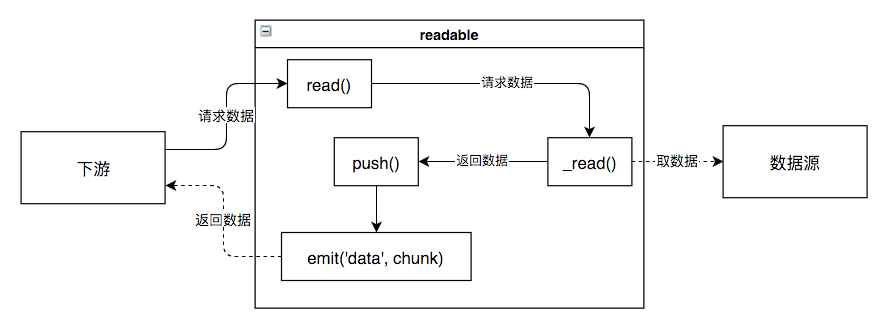
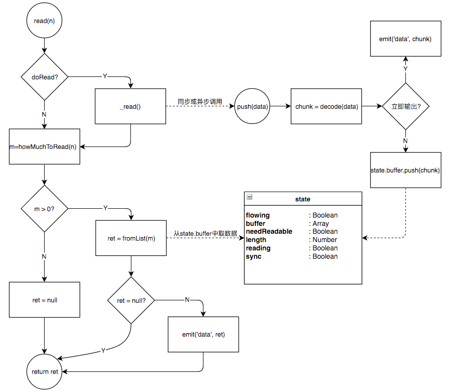

## 通过流读取数据
- 用Readable创建对象后，便得到了一个流
- 如果实现_read方法，就将流连接到一个底层数据源
- 流通过调用_read向底层请求数据，底层再将调用流的push方法将需要的数据传递过来
- 当readable连接了数据源之后，下游便可以调用readable.pipe(n)向流请求数据，同时监听readable的data事件来处理接收到的数据

## read
read方法中的逻辑可以用下图表示

## push 
- 消耗方调用read促使流输出数据，而流通过_read()使底层调用push方法将数据传给流
- 如果流在流动模式下(state.flow为true)输出数据，数据就会自动的通过data事件输出，不需要消耗方反复调用read(n)
- 如果调用push方法的时候缓存为空，则当数据即为下一个需要的数据。这个数据可能先添加到缓存中，也可能直接输出。
- 执行read方法时，在调用_read后，如果从缓存中取到了数据，就以data事件输出。
- 所以，如果_read异步调用push的时候发现缓存为空，则意味着当前数据是下一个需要的数据且不会被read方法输出，应当在push方法中立即以data事件输出。

## end
- 在调用完_read事件后，read(n)会试着从缓存数中取数据
- 如果_read()是异步调用push方法的，则此时缓存中的数据量不会增多，而且容易出现数据量不够的现象
- 如果read(n)的返回值是null，说明这次未能从缓存中取出所需的数据。此时，消耗方需要等待新的数据到达后再次尝试调用read方法
- 在数据到达后，流是通过readable事件来通知消耗方的
- 在这种情况下，push方法如果立刻输出数据，接收方直接监听data事件即可，否则数据被添加到缓存中，需要出发readable事件
- 消耗方必须监听这个readable事件，再调用read方法取得数据

## doRead
- 流中维护了一个缓存，当缓存的数据足够多的时候，调用read()不会引起_read的调用，即不需要向底层请求数据
- 用doRead表示read(n)是否需要向底层取数据
- state.reading标志上次从底层取数据的操作是否已经完成。一旦push方法被调用，就会设置为false，表示此次_read()结束
- state.highWaterMark是给缓存大小设置得一个上限阈值
- 
## howMuchToRead
- 用read(n)去取n个数据时，m=howMuchToRead(n)是将从缓存中实际获取的数据量
- 可读流是获取底层数据的工具，消耗方通过调用read方法向流请求数据，流再从缓存中将数据返回，或以data事件输出。
- 如果缓存中数据不够，便会调用_read方法去底层取数据
- 该方法拿到底层数据之后，调用push方法将数据交给流处理（立即输出或者缓存）
- 可以结合readable事件和read方法来将数据全部消耗，这是暂停模式的消耗方法
- read(0)只是填充缓存区，并不是真正读取
- read()如果处于流动模式，并且缓存区大小为空，则返回缓存区地铁一个buffer的长度，否则读取整个缓存。如果读到了数据没有返回值，但是会发射data事件，数据也能取到，也就是用来青村缓存区
