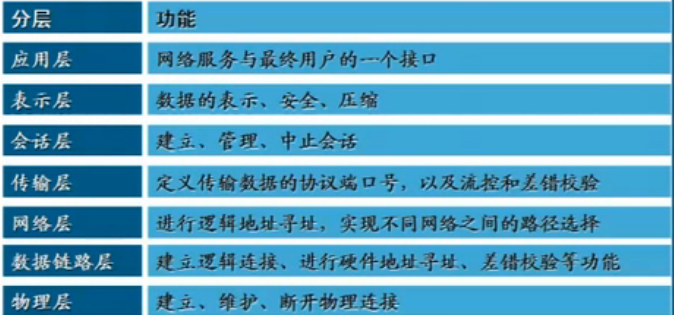
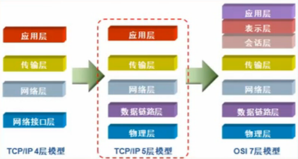

##  协议的概念和作用
- 为了让计算机能够通信，计算机需要定义通信规则，这些规则就是协议
- 规则有很多种，协议也有很多种
- 协议就是数据封装格式+传输

## OSI七层模型
Open System Interconnection,适用于所有的网络
- 分工带来能效 松江黄金大劫案
- 将复杂的流程分解为几个功能相对单一的子进程
- 流程更加清晰，复杂问题简单化
- 更容易发现问题并且针对性解决问题
> 应用层(Application) 提供网络与用户应用软件之间的接口服务
> 
> 表示层(Presentation) 提供格式化的表示和转换数据服务，如加密和压缩
> 
> 会话层(Session) 提供包括访问验证和会话管理在内的建立和维护应用之间通信的机制
> 
> 传输层(Transimission) 提供建立、维护和取消传输连接功能，负责可靠地传输数据(PC)
> 
> 网络层(Network) 处理网络间路由，确保数据及时传送(路由器)
>
> 数据链路层(DataLink) 负责无错传输数据，确认帧、发错重传等(交换机)
> 
>物理层(Physics) 提供机械、电气、功能和过程特性(网卡、网线、双绞线、同轴电缆、中继器)

## TCP/IP参考模型
TCP/IP是传输控制协议/网络互联协议的简称

早期的TCP/IP模型是一个四层结构，从下往上依次是网络接口层、互联网层、传输层和应用层

后来在使用过程中，借鉴OSI七层参考模型，将网络接口层划分为了物理层和数据链路层，形成五层结构

### 常用协议
TCP/IP协议被称为传输控制协议/互联网协议，又称网络通讯协议，是由网络层的IP协议和传输层的TCP协议组成，是一个很大的协议集合

物理层和数据链路层没有定义任何特定协议，支持所有的标准和专用的协议

网络层定义了网络互联也就是IP协议

- 网际协议IP(Internet Protocal) 负责主机和网络之间寻址和路由数据包
- 地址解析协议ARP(Address Resolution Protocol) 获得同一物理网络中的硬件主机MAC地址
- 反向地址转换协议(Reverse Address Resolution Protocol) 允许局域网的物理机器从网关服务器的ARP表或者缓存上请求其IP地址
- 网际控制消息协议ICMP(Internet Control Message Protocol) 发送消息，并报告有关数据包的传送错误
- 互联组管理协议IGMP(Internet Group Management Protocol) IP主机向本地多路广播路由器报告主机组成员

传输层定义了TCP(传输控制协议)和UDP(用户数据报)协议

应用层定义了HTTP(超文本传输协议)、FTP(文件传输协议)、DNS(域名系统)等协议
