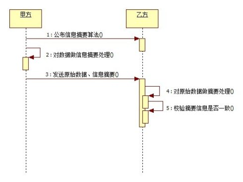
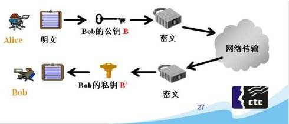

## 1.crypto

crypto 是在 node 中实现解密和加密的模块，使用 openssl 类库作为内部实现加密和解密的手段，OpenSSL 是一个经过严格测试的可靠的加密解密实现工具

## 2.散列哈希算法

散列算法就是哈希算法，用来吧任意长度的输入变成固定长度的输出，常见的有 MD5 和 SHA1 等

- 相同的输入会产生相同的输出
- 不同的输入会产生不同的输出
- 任意的输入长度输出长度是相同的
- 不能从输出推算输入的值
  

### 2.1 获取所有的散列算法

```js
console.log(crypto.getHashs());
```

### 2.2 获取所有的散列算法

```js
hash = crypto.createHash(algorithm); //创建HASH对象
hash.update(data, [input_encoding]); //增加要添加摘要的数据，摘要输出前可以使用多次update
hash.digest([encoding]); //输出摘要内容，输出后则不能再添加摘要内容
```
### 2.3实例
```js
const crypto = require('crypto')
var md5 = crypto.createHash('md5')
var md5Sum = md5.update('hello')
const result = md5Sum.digest('hex')
console.log(result);
```
```js
const crypto = require('crypto')
const fs = require('fs')

var md5 = crypto.createHash('md5')
var rs = fs.createReadStream('./readme.txt')
rs.on('data', (data) => {
  md5.update(data)
})
rs.on('end', (data) => {
  console.log(md5.digest('hex'));
})

```

## HMAC算法
HMAC算法将散列算法与一个密钥结合在一起，以阻止对签名完整性的破坏

### 3.1 用法
```js
let hmac = crypto.createHmac(algorithm,key);
hmac.update(data);
// algorithm 是一个可用的摘要算法，例如 sha1、md5、sha256
// key为一个字符串，用于指定一个PEM格式的密钥
```

### 3.2 生成私钥
PEM是OpenSSL的标准格式，OpenSSL使用PEM文件格式存储证书和密钥，是基于Base64编码的证书。
```js
$ openssl genrsa -out rsa_private.key 1024
```
### 3.3 示例
```js
let pem = fs.readFileSync(path.join(__dirname, './rsa_private.key'));
let key = pem.toString('ascii');
let hmac = crypto.createHmac('sha1', key);
let rs = fs.createReadStream(path.join(__dirname, './1.txt'));
rs.on('data', function (data) {
    hmac.update(data);
});
rs.on('end', function () {
  let result = hmac.digest('hex');
  console.log(result)
})
```
## 对称加密
blowfish算法是一种对称的加密算法,对称的意思就是加密和解密使用的是同一个密钥。

### 4.1
```js
// 使用的是相同的秘钥
var crypto = require('crypto');
var fs = require('fs');
let str = 'hello';
let cipher = crypto.createCipher('blowfish', fs.readFileSync(path.join(__dirname, 'rsa_private.key')));
let encry = cipher.update(str, 'utf8','hex');
encry += cipher.final('hex');
console.log(encry);

let deciper = crypto.createDecipher('blowfish', fs.readFileSync(path.join(__dirname, 'rsa_private.key')));
let deEncry = deciper.update(encry, 'hex','utf8');
deEncry += deciper.final('utf8');
console.log(deEncry);
```
## 5非对称加密
非对称加密算法需要两个密钥：公开密钥(publickey)和私有密钥(privatekey)

公钥与私钥是一对，如果用公钥对数据进行加密，只有用对应的私钥才能解密,如果私钥加密，只能公钥解密

因为加密和解密使用的是两个不同的密钥，所以这种算法叫作非对称加密算法


```js
// 公钥加密，私钥解密
var crypto = require('crypto');
var fs = require('fs');
let key = fs.readFileSync(path.join(__dirname, 'rsa_private.key'));
let cert = fs.readFileSync(path.join(__dirname, 'rsa_public.key'));
let secret = crypto.publicEncrypt(cert, buffer);//公钥加密
let result = crypto.privateDecrypt(key, secret);//私钥解密
console.log(result.toString());
```

## 6.签名
在网络中，私钥的拥有者可以在一段数据被发送之前先对数据进行签名得到一个签名 通过网络把此数据发送给数据接收者之后，数据的接收者可以通过公钥来对该签名进行验证,以确保这段数据是私钥的拥有者所发出的原始数据，且在网络中的传输过程中未被修改。


```js
let private = fs.readFileSync(path.join(__dirname, 'rsa_private.key'), 'ascii');
let public = fs.readFileSync(path.join(__dirname, 'rsa_public.key'), 'ascii');
let str = 'zhufengpeixun';
let sign = crypto.createSign('RSA-SHA256');
sign.update(str);
let signed = sign.sign(private, 'hex');
let verify = crypto.createVerify('RSA-SHA256');
verify.update(str);
let verifyResult = verify.verify(public,signed,'hex'); //true
```
