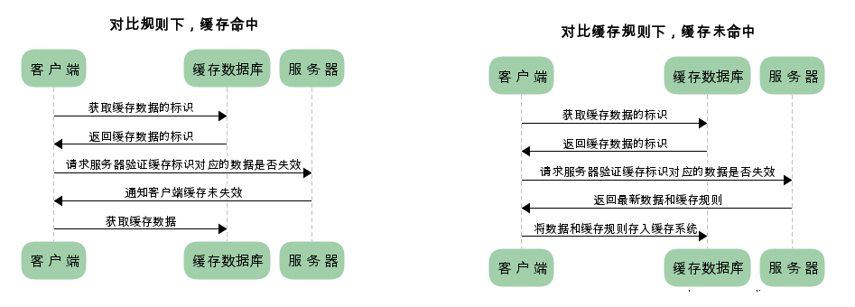

## 1.缓存作用

- 减少冗余的数据传输，节省了网费。
- 减少了服务器的负担，大大提高了网站的性能
- 加快速度

## 2.缓存分类

强制缓存如果生效，不需要再和服务器发生交互；对比缓存不管是否生效，都需要与服务端发生交互

两类缓存规则可以同时存在，强制缓存优先级高于对比缓存，也就是说，当执行强制缓存的规则时，如果缓存生效，直接使用缓存，不再执行对比缓存规则

### 2.1 强制缓存

强制缓存，在缓存数据未失效的情况下，可以直接使用缓存数据，那么浏览器是如何判断缓存数据是否失效呢？ 我们知道，在没有缓存数据的时候，浏览器向服务器请求数据时，服务器会将数据和缓存规则一并返回，缓存规则信息包含在响应 header 中。

### 2.2 对比缓存

- 对比缓存，顾名思义，需要进行比较判断是否可以使用缓存。
- 浏览器第一次请求数据时，服务器会将**缓存标识**与数据一起返回给客户端，客户端将二者备份至缓存数据库中。
- 再次请求数据时，客户端将备份的**缓存标识**发送给服务器，服务器根据**缓存标识**进行判断，判断成功后，返回 304 状态码，通知客户端比较成功，可以使用缓存数据。

## 3.请求过程

### 3.1 第一次请求

### 3.1 第二次请求

使用缓存

## 4.通过最后修改时间来判断缓存是否可用
- Last-Modified：响应时告诉客户端此资源的最后修改时间
- If-Modified-Since：当资源过期时（使用Cache-Control标识的max-age），发现资源具有Last-Modified声明，则再次向服务器请求时带上头If-Modified-Since。
- 服务器收到请求后发现有头If-Modified-Since则与被请求资源的最后修改时间进行比对。若最后修改时间较新，说明资源又被改动过，则响应最新的资源内容并返回200状态码；
- 若最后修改时间和If-Modified-Since一样，说明资源没有修改，则响应304表示未更新，告知浏览器继续使用所保存的缓存文件。

## 5.最后修改时间存在问题
