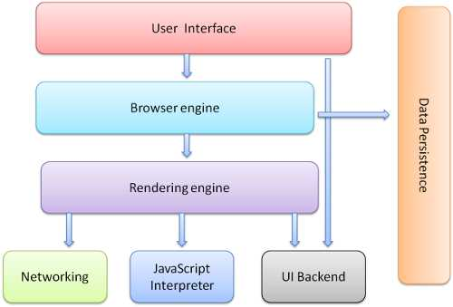

## Node是什么
- Node.js 是一个基于 Chrome V8 引擎的 JavaScript 运行环境,让JavaScript的执行效率与C语言的相近的执行效率。
- Node.js 使用了一个事件驱动、非阻塞式 I/O 的模型，使其轻量又高效。
- Node.js 的包管理器 npm，是全球最大的开源库生态系统。

## Node特点
#### 1.为什么js是单线程
- 由js的语言用途决定
- webWorker并没有改变js单线程本质
#### 2.浏览器模型
- 用户界面，包括地址栏、前进后退、书签菜单
- 浏览器引擎，在用户界面和呈现引擎之间传送指令
- 渲染引擎，浏览器内核，也称为UI线程
- 网络，用于网络调用，如HTTP请求
- 用户界面后端，用于绘制基本的窗口小部件，UI线程和JS共用一个线程
- JS解释器，用于解析和执行JS代码
- 数据储存，这是持久层。浏览器需要在硬盘上保存各种数据，如cookie。

#### 3.除JS线程和UI线程之外的其他线程
- 浏览器时间触发线程
- 定时器触发线程
- 异步HTTP请求线程

#### 4.任务队列
 1. 所有的同步任务在主线程上执行，形成一个执行栈。
 2. 主线程之外，还存在一个任务队列。只要异步任务有了运行结果，就在任务队列中放置一个事件。
 3. 一旦执行栈中的所有的同步任务执行完毕，系统就会读取任务队列。那些对应的异步任务，于是结束等待状态，尽心执行栈，开始执行。
 4. 主线程会不断循环以上三步。

#### 5.Event Loop
主线程从任务队列中读取事件，这个过程是不断循环的，所以这个运行机制称为事件循环**Event Loop**。

#### 6.Nodejs的Event Loop

 1. V8引擎解析脚本
 2. 解析后的代码调用NodeApi
 3. libuv库负责Node API的执行。它将不同的任务分配给不同的线程，形成一个Event Loop（事件循环），以异步的方式将任务的执行结果返回给V8引擎。
 4. V8引擎再将结果返回给用户。

#### 7.同步和异步

同步和异步关注的是消息通知机制
- 同步就是发出调用后，没有得到结果之前，该调用不返回，一旦调用返回，就得到返回值了。简而言之就是调用者注定等待这个调用的结果。
- 异步在调用者发出这个调用就直接返回了，所以没有返回结果。当一个异步过程调用发出后，调用者不会立即得到结果，而是调用发出后，**被调用者**通过状态、通知或回调函数来处理这个调用。

#### 8.阻塞与非阻塞
阻塞和非阻塞关注的是程序在等待调用结果(消息、返回值)的状态
- 阻塞调用是指在结果返回之前，当前线程会被挂起。调用线程只有在得到结果之后才会返回。
- 非阻塞是指不能立刻得到结果之前，给调用不会阻塞当前线程

#### 9.组合
同步和异步取决于被调用者，阻塞和非阻塞取决于调用者
- 同步阻塞
- 异步阻塞
- 同步非阻塞
- 异步非阻塞

#### 10.考虑使用Node框架的场合
当应用处理程序需要处理并发的输入输出，而在向客户端相应之前，应用程序并不需要进行非常复杂的处理。
- 聊天服务器
- 电子商务网站
