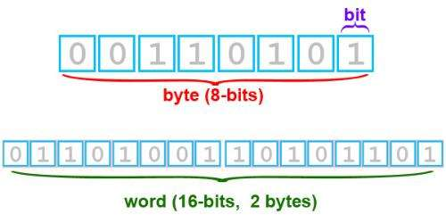
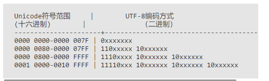

## 字符发展史

#### 字节

计算机内部，信息都是一个二进制值。

每一个二进制位(bit)都有 0/1 两种状态，因此八个二进制位就有 256 个状态，称一个字节(byte)



#### 单位

8 位=1 字节

1024 字节=1K

1024K=1M

1024M=1G

1024G=1T

#### JS 中的进制

##### 进制表示

```js
let a = 0b10100; //二进制
let b = 0o24; // 八进制
let c = 24; // 十进制
let d = 0x14; // 十进制
```

##### 进制转换

十进制转任意进制

```js
//10进制数.toString(目标进制)
consoel.log(c.toString(2));
```

任意进制转十进制

```js
// parseInt('任意进制字符串', 原始进制);
console.log(parseInt("10100", 2));
```

#### ascii

[ascii](https://zh.wikipedia.org/zh-hans/ASCII)

-   0-32 特殊用途
-   空格、标点符号、数字、大小写字母分别用连续的字节状态
-   0-127 共 128 字符

American Standard Code for Information Interchange：美国信息互换标准代码


#### gb2312

[gb2312](https://zh.wikipedia.org/wiki/GB_2312)

在 0-127 的基础上添加了一些，因为西欧的国家有的不是用英文，从 128 到 255 的字符集被称为扩展字符集。

中国为了表示汉字，又进行了扩充

-   一个小于 127 的字符的意义与原来相同，但两个大于 127 的字符连在一起时，就表示一个汉字；
-   前面的一个字节（称之为高字节）从 0xA1 用到 0xF7，后面一个字节（低字节）从 0xA1 到 0xFE，这样我们就可以组合出大约 7000 多个(247-161)\*(254-161)=(7998)简体汉字了
-   还把数学符号、日文假名和 ASCII 里原来就有的数字、标点和字母都重新编成两个字长的编码。这就是全角字符，127 以下那些就叫半角字符
-   **把这种汉字方案叫做 GB2312。GB2312 是对 ASCII 的中文扩展**

#### GBK

[GBK](https://zh.wikipedia.org/wiki/%E6%B1%89%E5%AD%97%E5%86%85%E7%A0%81%E6%89%A9%E5%B1%95%E8%A7%84%E8%8C%83)

不再要求低字节一定是 127 号之后的内码，只要第一个字节是大于 127 就固定表示这是一个汉字的开始,又增加了近 20000 个新的汉字（包括繁体字）和符号。

#### GB18030 / DBCS

[GB18030](https://zh.wikipedia.org/wiki/GB_18030)

Double Byte Character Set：双字节字符集。

加了几千个新的少数民族的字，GBK 扩成了 GB18030 通称他们叫做 DBCS

#### unicode

[unicode](https://zh.wikipedia.org/wiki/Unicode)
ISO 的国际组织废了所有的地区性编码方案，重新搞一个包括了地球上所有文化、所有字母和符 的编码！ Unicode 当然是一个很大的集合，现在的规模可以容纳 100 多万个符号。

International Organization for Standardization：国际标准化组织。

Universal Multiple-Octet Coded Character Set，简称 UCS，俗称 Unicode

#### utf8

[utf8](https://zh.wikipedia.org/wiki/UTF-8)

-   UTF-8 就是在互联网上使用最广的一种 Unicode 的实现方式
-   UTF-8 就是每次以 8 个位为单位传输数据
    而 UTF-16 就是每次 16 个位
-   UTF-8 最大的一个特点，就是它是一种变长的编码方式
-   Unicode 一个中文字符占 2 个字节，而 UTF-8 一个中文字符占 3 个字节
-   UTF-8 是 Unicode 的实现方式之一

#### 编码规则

-   单字节，字节第一位设置为 0，后面的 7 位为证符号的 unicode 码。因为对于英语字母，utf8 和 ascii 是一样的
-   对于 n 字节的符号（n>1）,第一个字节的前面 n 为都是 1，第 n+1 为设置为 0，后面字节的前两位都是 10.剩下的没有提及的二进制位，全部为这个符号的 unicode 编码



unicode 编码

```js
function transfer(num) {
    let ary = ["1110", "10", "10"];
    let binart = num.toString(2);
    ary[2] = ary[2] + banary.slice(binary.length - 6);
    ary[1] = ary[1] + banary.slice(binary.length - 12, binary.length - 6);
    ary[0] = ary[0] + banary.slice(0, binary.length - 12).padStart(4, "0");
    let result = ary.join("");
    return parseInt(result, 2).toString(16);
}
let result = transfer(0x4e07); //E4B887
```

#### 文本编码

常用文本 utf8 和 gbk，并且 utf8 文件还有可能带有 bom。在读取不同编码的文本文件时，需要将文件内容转换为 js 使用的 utf8 编码字符串后才能正常使用

##### bom 的移除

bom 用于标记一个文本文件使用 unicode 编码，其本身是一个 unicode 字符("\uFEFF")，位于文本文件头部。在不同的 unicode 编码下，bom 字符对应的二进制如下：
| Bytes | Encoding
-----------|-----------------
| FE FF | UTF16BE
| FF FE | UTF16LE
| EF BB BF | UTF8


因此我们可以根据文本文件头几个字节来判断文件是否包含了bom，以及使用哪种unicode编码。bom虽然起到了标记文本编码的作用，但是其本市不属于文本内容的一部分。

如如果读取文本时不去掉bom，在某些情况就会有问题。比如把几个js文件合并成一个js文件，如果文本中间含有bom字符，就会导致浏览器语法错误。因此在使用nodejs读取文本文件时，一般需要去掉bom
```js
function readText(pathname){
    var bin=fs.readFileSync(pathname);
    if(bin[0] === 0xEF && bin[1] === 0xBB && bin[2] === 0xBF){
        bin=bin.slice(0,3)
    }
    reutrn bin.toString('utf-8)
}
```

##### GBK转UTF-8
nodejs支持在读取文本时，或者在Buffer转换为字符串时制定文本编码，但是GBK不在Nodejs自身支持范围内。因此需要借助iconv-lite这个第三方包来转换编码。
```js
var iconv=require('iconv-lite');
function readGBKText(pathname){
    var bin=fs.readFileSync(pathname);
    return iconv.decode(bin,'gbk)
}

```

#### 扩展
[utf8](http://www.ruanyifeng.com/blog/2007/10/ascii_unicode_and_utf-8.html)

[字符编码的故事](https://tianziyao.github.io/2017/07/03/%E5%AD%97%E7%AC%A6%E7%BC%96%E7%A0%81%E7%9A%84%E6%95%85%E4%BA%8B/)
